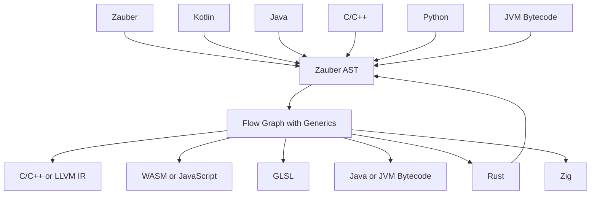

# Zauber 🪄

Zauber is a modern programming language with focus on usability, performance, and memory-safety.


This project is still in its infancy, but I really do want a language without compromises and
constantly thinking about switching from Kotlin to Zig or Rust.

Zauber is my personal learning project to learn more about compilers,
so things may stay unstable for a while, and I'm probably turning it into a whole
compiler framework, because I want to learn it all 🤩.

## Learn Zauber

I've also written a small tutorial in this project to get you started:
[Learn Zauber today](tutorial/01_Introduction.md).

The compiler is not working yet, so...
Theoretically, the interpreter can run the first things now...

## Motivation

My main motivation is
- a) [CodeGeneration] being able to generate IO code automatically (making reflections compile time, and therefore cheaper)
- b) [GC Overhead] not constantly having to think about native-types-as-generics/short-lived-objects-Overhead and GC-lag
- c) [GPU Debugging] being able to run and debug GLSL code on the CPU (by compiling Zauber to both LOL)
- d) [Native Performance], [JNI Overhead], [Vectorization] not being constantly reminded that my code could run twice as fast
- e) [Libraries] lots of libraries are written in C/C++, but finding/creating bindings is always a pain

Side motivation:
- Getting independent of Intellij Idea (see https://youtrack.jetbrains.com/issue/IDEA-68854, hot topic for 14 years, and still unsolved),
- Developing our own language tooling without needing the Intellij SDK

## Goals:
- Kotlin-style
- Native C/C++ performance
- Rust-style enums (e.g. for errors) AKA union types → these are just sealed classes, aren't they?
- Rust-style macros (or at least their power)
- Struct types aka not storing the object header where not necessary
- Easy struct of arrays
- Optionally strong generics AKA making ArrayList<Float> contain a FloatArray instead of an Array<Float>
- GLSL cross compilation: debug statements on GPU & running the same algorithms on CPU
- Compile-Time execution using an interpreter
- Variable-Index-Based Virtual Machine code (could be converted to stack-based VM code for JVM)
- Fixed Point arithmetic without OOP/GC overhead
- Stack-located variables
- Comptime execution / code generation
- Python-like Multi-assignment-style to swap fields: (a,b) = (b,a)

I'd like to compile Rem's Engine (200k LOC + stdlib) to C++ in less than 30 seconds.
Ideally much faster.

## Milestones:

(can be checked off when my game engine and this compiler can be processed)

- [x] Tokenizing Kotlin
- [x] Parsing Kotlin to an AST
- [ ] Type Resolution
- [x] Basic Code Generation
- [ ] Basic GC for JVM-style objects (default for Kotlin compatibility)
- [ ] Different Allocators
- [ ] ...
- [ ] Compile and run the compiler using Zauber
- [ ] Compile and run Rem's Engine using Zauber
- [ ] Compile to a native language (or LLVM IR)
- [ ] Compile to WASM (for running in the browser & safe containers)

## General Plan

The following is a rough outline, what this project wants to achieve ultimately:



The Zauber AST is a typical AST:
- Kotlin-inspired
- most members aren't resolved or parsed yet
- deeply nested
- lazy evaluation (for faster compilation)
- single flow
- high-level flow-control, e.g. while, try-catch, defer, ...
- generic

The Flow Graph is a special AST:
- all types, fields and methods have been resolved
- flattened expressions with temporary (nameless) fields
- low-level flow-control: only branches and calls
- splits flow into value (normal execution), returned (passing finally/defer) and thrown (passing catches/errdefer)
- generics are (partially) specialized (resolved)

For generating code, there are two potential ways:
- use other language's code as 'Zauber'
- compile-time - generated bindings (easier)

## Budget

I'm planning to spend about 1-2 years (of my life) on this.

Comparisons:
- own game engine: ~5-10 years budget
- own video editor: ~2 years budget

## Type Definitions

I want to be able to declare rich types like TypeScript,
and not to pay the runtime overhead, e.g.

```kotlin
value class Euro(val value: Int) {
// plus, times, ...
}

typealias FloatLike = Half|Float|Double
typealias SeriComp = Serializable&Comparable<*>
typealias NotFloat = Number&!FloatLike
```

Static analysis (not yet implemented) can also be really helpful and powerful,
so it would be nice to have comptime-restricted types, e.g.

```kotlin
val x: Int { it in 0 until 100 } = 45
val somePrime: Int { isPrime(it) } = 17
val cheapEnum: String { it in listOf("a", "b", "c") } = "a"
```

## Allocation Styles
(not yet implemented)

```kotlin
data class Vec2i(val x: Int, val y: Int)

value var x = Vec2i(0, 0) // will be stored on the stack
val y = Vec2i(0, 0) // will be ref-counted or GCed
value val array = Array(10) {
    Vec2i(
        it,
        it * it
    )
} // all entries will share one GC/type-overhead; constant size -> could be stored on the stack
val floatArray =
    arrayOf(0f, 1f, 2f) // 4 bytes per entry, because type can be shared, and floats is marked as a value class
```

floatArrayOf() will only be available in Kotlin files. Zauber uses arrayOf() for all types.

## Reflection

I'd like the reflection API to be completely comptime like in Zig,
so if you don't use it, you don't need the (space)overhead.

## Standard Library

Java has application specific classes/packages like AWT, Swing, java.sql, and idk why...
These should be implemented in libraries.

Kotlin libraries are weird, they ship compiled JVM Bytecode with special byte-encoded annotations.
Java libraries are good w.r.t. that they can be loaded at runtime, but that also makes them less secure.
Therefore, I'd like Zauber libraries to be plain Zauber code packages as a zip- or tar-file.
If you need obfuscation, obfuscate all library-internal logic.

For generated code in other languages, I'll add the basics to get the language working, and ideally auto-compile-time bindings for the stdlib, but more than that will be up to 3rd party libraries.

## Progress Estimation

This represents the general point of where Zauber is right now. Quite a few things work already, but we're still far away from having a stable language.

### Language Features

Here is the general state of Zauber right now:

| Feature                               | State                                                                       |
|---------------------------------------|-----------------------------------------------------------------------------|
| Branches                              | 100%                                                                        |
| Loops                                 | 100% in interpreter, 70% in compilers                                       |
| Class Inheritance                     | 100% in interpreter, 10% in compilers                                       |
| Interface Inheritance                 | 100% in interpreter, 10% in compilers                                       |
| Compile Time Reflections              | 10% in interpreter (compiler irrelevant)                                    |
| Macros                                | 25%, only as functions right now, as field/class/method annotations missing |
| Try-Catch-Finally                     | 70% in interpreter (most places support it), 0% in compilers                |
| Defer, Errdefer                       | Fully work, internally use try-catch-finally logic                          |
| Fields, Methods                       | Base versions work, extension fields not yet well                           |
| Inner Classses, Functions             | Can be type-resolved, but not yet properly executed                         |
| Lambdas                               | Type-Resolution works partially, runtime not                                |
| Async and Yield                       | Type-Resolution works, runtime not                                          |
| Importing things from other languages | Not implemented yet                                                         |

### Importing other languages

*This intends to transpile other languages to Zauber, so we can use libraries from all the programming world.*

Very proof-of-concept at the moment, started a little for Python, Java, TypeScript, and of course Kotlin.

### Binding other languages

Not really started yet, only possible when compiling to that language,
and declaring an external function; self is a must right now.

### Compilation

The interpreter works relatively well, but yield isn't supported yet.

For compiling, while a lot of targets have proof-of-concepts, none are production ready.
Simple things like variables, branches, loops, and classes (non-inheritance) work in all targets.

Available targets:
- **JVM** via Java + JDK
- **Rust** with single-threaded GC
- **C++** without memory-management (just infinite allocations like Zig's compiler)
- **LLVM IR** without memory-management
- **WASM** with native GC
- **JavaScript** with native GC

Planned targets:
- **TypeScript** (because we have JavaScript, should be easy)
- **Zig** (because we have Rust and borrowed its defer and errdefer)
- **Python** (for machine learning)
- **C** (without C++)

Inheritance works in the Java target, I believe.
For quickly testing WASM, there is also a small WASM reader and runtime.

Eventually, the generated code should look nice,
and have proper names everywhere. For now, I focus on getting things started/working though.

## Origin of the name "Zauber" 🪄

Programming languages are magic to even most developers, and I like the German words "Zauber" and "Zauberei".
Compilers are/were pretty magic to me before I got well into this project too, although I had some [JVM2WASM](https://github.com/AntonioNoack/jvm2wasm) experience.

